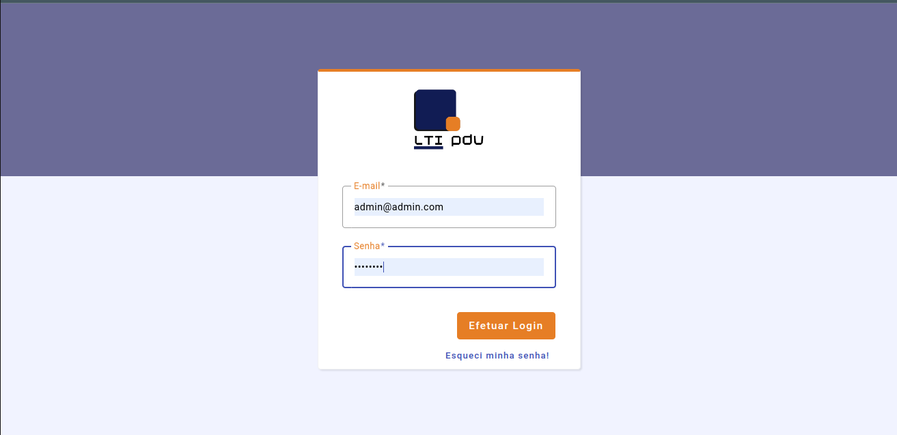
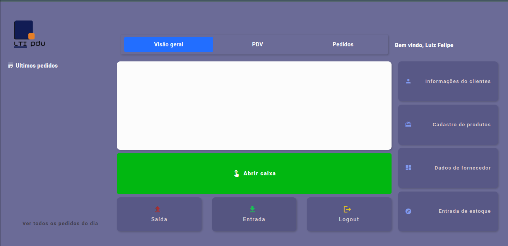

<p align="center">
  <a href="https://unform.dev">
    
  </a>
</p>
<h1 align="center">LTI PDV (Mini ERP Comercial)</h1>
<p>🚀 Pequeno sistema de automação de lojas, focado em lojas de bairros, com um pratico e simples PDV e cadastro de produtos.</p>

<div align="center">

     [](https://github.com/ltisistemas/mini-erp-comercial/actions/workflows/main-deploy.yml)

</div>

# Tabela de conteúdos

<!--ts-->

- [Sobre](#Sobre)
- [Tabela de Conteudo](#tabela-de-conteudo)
- [Instalação](#instalacao)
- [Como usar](#como-usar)
  - [Pre Requisitos](#pre-requisitos)
  - [Local files](#local-files)
  - [Remote files](#remote-files)
  - [Multiple files](#multiple-files)
  - [Combo](#combo)
- [Tests](#testes)
- [Tecnologias](#tecnologias)
<!--te-->

<h4 align="center"> 
	🚧  LTI PDV (Mini ERP Comercial) 🚀 Em construção...  🚧
</h4>

<div align="center" style="display: flex; align-items: flex-start; justify-content: center;">





</div>

### Features

- Workflow
  - [x] Build
  - [x] GH Pages
  - [x] Badges
  - [x] Config. Angular to GH Pages
- Tela de Login
  - [x] Layout
  - [x] Funcionalidade
  - [x] Estilização
- Cadastro interno de estado
  - [x] Realizado
- Cadastro interno de cidades
  - [x] Realizado
- Cadastro de empresa
  - Cadastro de usuário
- Cadastro de cliente
  - [x] Layout
  - [x] Funcionalidade
  - [x] Estilização
- Cadastro de produtos
  - [x] Layout
  - [ ] Funcionalidade
  - [x] Estilização
  - Cadastro de categoria
    - [x] Layout
    - [x] Funcionalidade
    - [x] Estilização
  - Cadastro de Subcategoria
    - [x] Layout
    - [x] Funcionalidade
    - [x] Estilização
- Cadastro de Fornecedores
- Cadastro de Entrada de Produtos (Pedido de entrada)
- PDV
- Pedido de vendas (Vendas B2B)

##### Relatorios

- Lista de clientes da empresa
- Lista de Produtos
- Lista de Fornecedores

- Vendas do dia
- Vendas do dia p/ Cliente
- Fechamento de caixa
- Abertura de caixa

### Pré-requisitos

<p>

Antes de começar, você vai precisar ter instalado em sua máquina as seguintes ferramentas:
[Git](https://git-scm.com), [Node.js](https://nodejs.org/en/). Como gosto de usar o Yarn pois acho ele mais rapido e pratico, basta baixa-lo através desse endereço: [Yarn](https://yarnpkg.com/).

</p>

<p>

Além disto é bom ter um editor para trabalhar com o código como [VSCode](https://code.visualstudio.com/)

</p>

### 🎲 Rodando a Aplicação

```bash
# Clone este repositório
$ git clone <https://github.com/ltisistemas/mini-erp-comercial>
```

```bash
# Acesse a pasta do projeto no terminal/cmd
$ cd mini-erp-comercial
```

```bash
# Instale as dependências
$ npm install / yarn
```

```bash
# Execute a aplicação em modo de desenvolvimento
$ npm start / yarn start
```

```bash
# O servidor inciará na porta:4200 - acesse <http://localhost:4200>
```

### 🛠 Tecnologias

As seguintes ferramentas foram usadas na construção do projeto:

- [Node.js](https://nodejs.org/en/)
- [Angular versão 16](https://angular.io/)
- [Angular Material](https://material.angular.io/)
- [TypeScript](https://www.typescriptlang.org/)
- [Firebase](https://firebase.google.com/?hl=pt-br)

### Autor

---

<a href="https://w.app/LTISistemas">
 
 <br />
 <sub><b>Luiz Felipe</b></sub></a> <a href="https://w.app/LTISistemas" title="LTI Sistemas">🚀</a>

Feito com ❤️ por Luiz Felipe 👋🏽 Entre em contato!

[](https://www.linkedin.com/in/luiz-felipe-marinho-dantas-bb37674b/)
[](mailto:luizltisistemas@gmail.com) [](https://www.instagram.com/o.luizfelipemd/)
